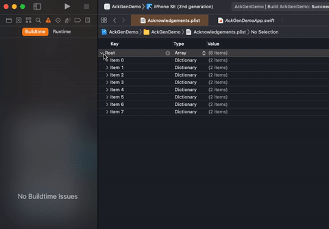

# AckGen

Simple **Ack**nowledgements **Gen**erator for SPM package license information.

## Overview

AckGen automatically generates a `plist` file containing the title and license information for all Swift packages used in your project.  
This can be used to feed a SwiftUI List or UITableView dataSource in your app.

|||
|---|---|
|  |  |

## Requirements

- Xcode 12+ (tested with 12.5)

## Installation

1. Add AckGen as a dependency for your project in Xcode.  

2. Add the following as a Run Script for your target in Xcode

```sh
DIR=$PROJECT_TEMP_DIR/../../../SourcePackages/checkouts/AckGen
if [ -d "$DIR" ]; then
  cd $DIR
  SDKROOT=macosx
  swift run ackgen
else
  echo "warning: AckGen not found. Please install the package via SPM (https://github.com/MartinP7r/AckGen#installation)"
fi
```

If you want the plist file to be saved somewhere other than `Acknowledgements.plist` at the root of your project (`$SRCROOT/Acknowledgements.plist`), you can provide a custom path as the first command line argument to `ackgen` above. 

```sh
  swift run ackgen $SRCROOT/PackageLicenses.plist
```

3. Add the generated `plist` file to your project if you haven't already.  
Make sure to remove the check for **Copy items if needed** 

4. You can now simply use the `plist` file however you like or use the `Acknowledgement` model for convenience:

```swift
import AckGen
// ...
let acknowledgements: [Acknowledgement] = Acknowledgement.all()
acknowledgements.forEach { print($0.title, $0.license) }
```

## UI

Optionally, there's a basic SwiftUI `AcknowledgementsList` component included in the `AckGenUI` module that you can use to quickly create a generic list of acknowledgements to embed into a `NavigationView`.


```swift
import AckGenUI
import SwiftUI

struct ContentView: View {
    var body: some View {
        NavigationView {
            AcknowledgementsList()
        }
    }
}
```

## Beta

Until 1.0 is reached, minor versions will be breaking.

## Contribution

This is my first stab at building a Swift package and was mainly intended to be an exercise.  
I hope, however, that it can be useful to someone other than me. 

If you encounter any problems or have suggestions, additions or possible improvements to share, you are more than welcome to open a PR or issue and I'll get back to you as soon as my time allows it.

## TODO

- [ ] Add non-SPM licenses separately
- [x] Add UI components (SwiftUI List with NavigationLink to license info?)
- [ ] Allow Run Script Output Files as alternative to command line argument
- [ ] Allow to specify excluded packages
